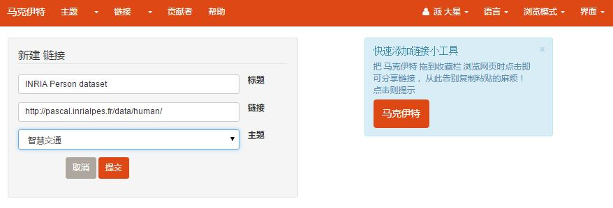
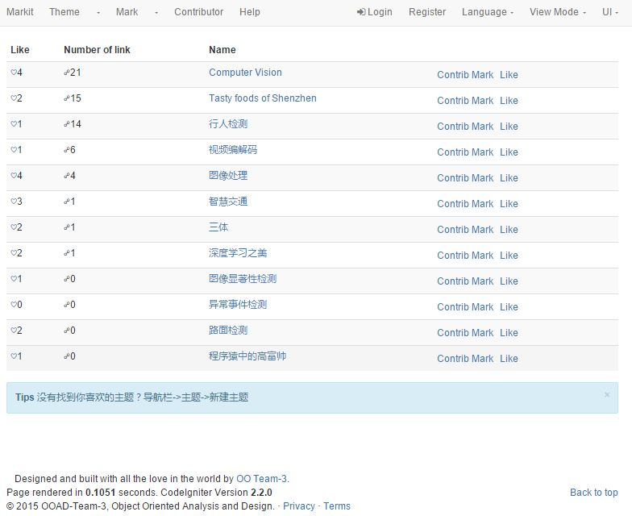
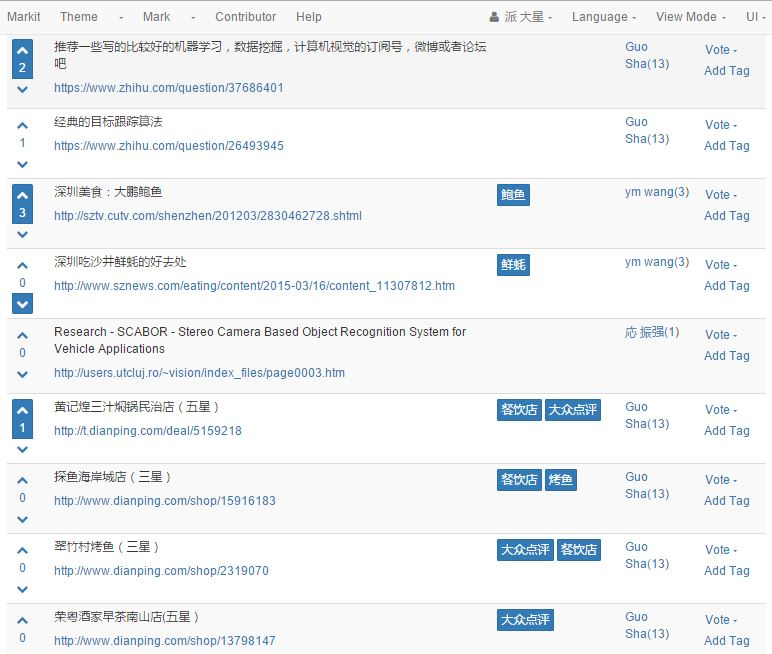
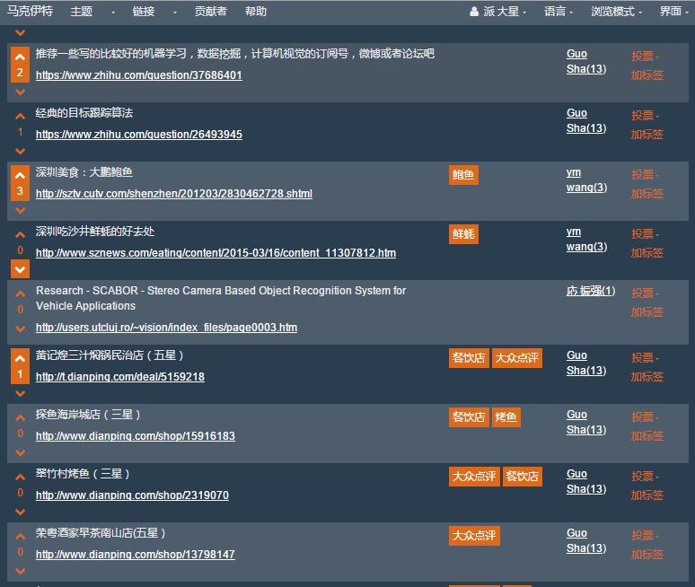

markit
======

a bookmark-sharing website

demo website: <http://markit.sinaapp.com/>

capture:

Markit tool: easy to add marks.

Explore themes: find your interests.

Explore marks: find related resources.

Switch ui themes/view mode/ langugage.

开发环境
--------

* via cross-platform environment: XAMPP (Linux/Windows)
* using php & MySQL
* front-end based on Bootstrap with Bootswatch themes.
* back-end based on Codeigniter MVC framework.

安装
---

安装说明 <https://github.com/baidut/markit/wiki/GetStarted>

<!-- 
1. 从[CI中国站](http://codeigniter.org.cn/downloads)下载CodeIgniter_2.2.0
1. 解压，只需要其中system文件夹下的所有文件
1. clone工程，添加system文件夹到工程根目录下
1. 修改数据库配置application\config\database
1. 导入数据库markit.sql
1. 修改网站基地址`$config['base_url']	= 'http://localhost/ci';`

注意：
 * system文件夹下为CI内核文件，不要修改，忽略此文件夹下的所有改动
 * 为了方便多人协作，对`application\config\database.php`的修改也被忽略，如有重要的修改则取消忽略此文件（.gitignore最后一行前加#号注释）

代码说明参见：https://github.com/baidut/markit/wiki
 -->